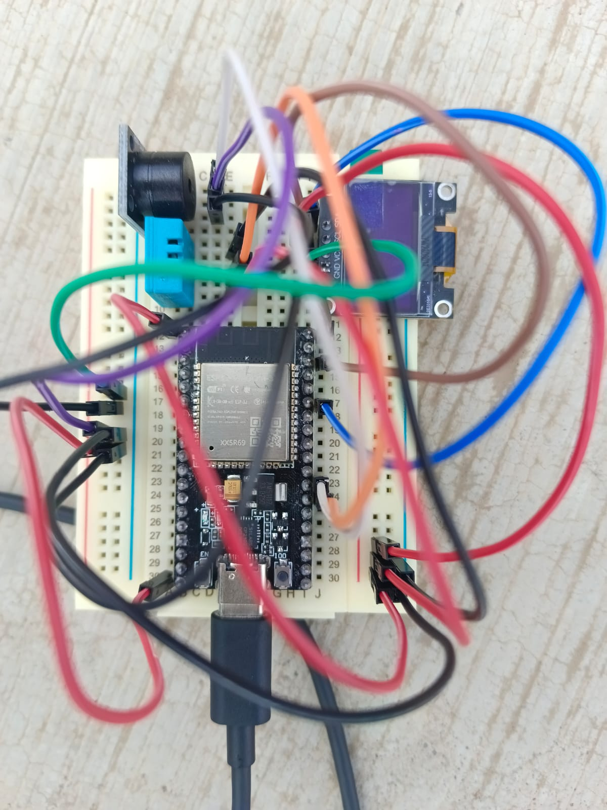
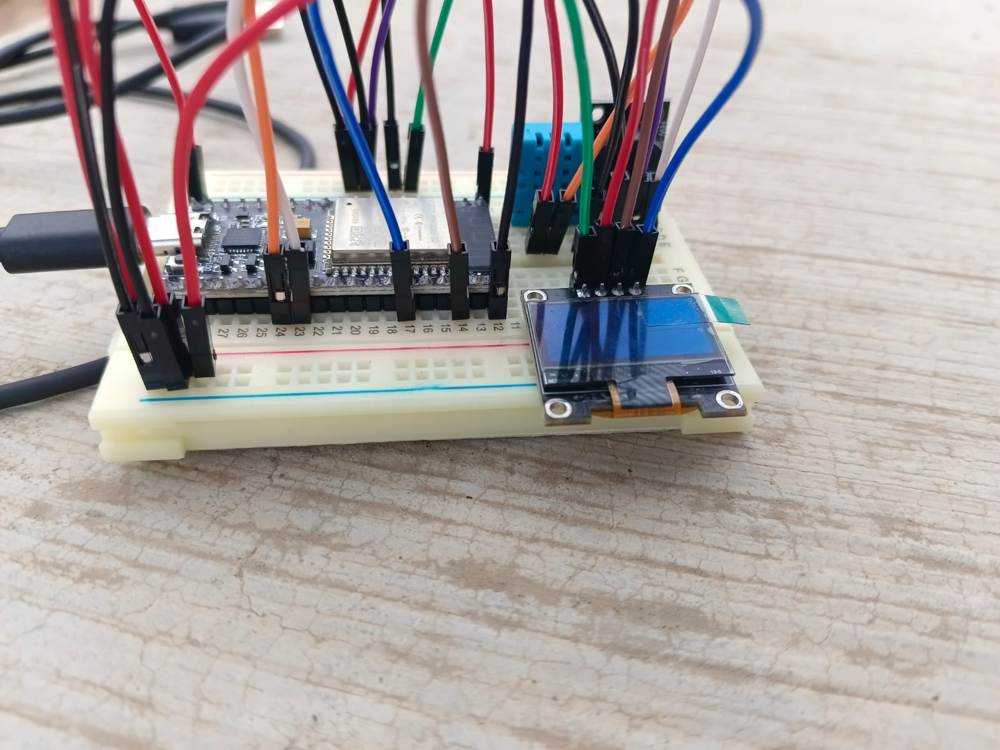
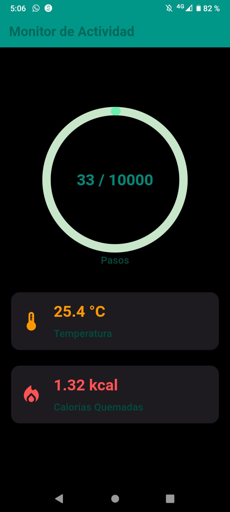
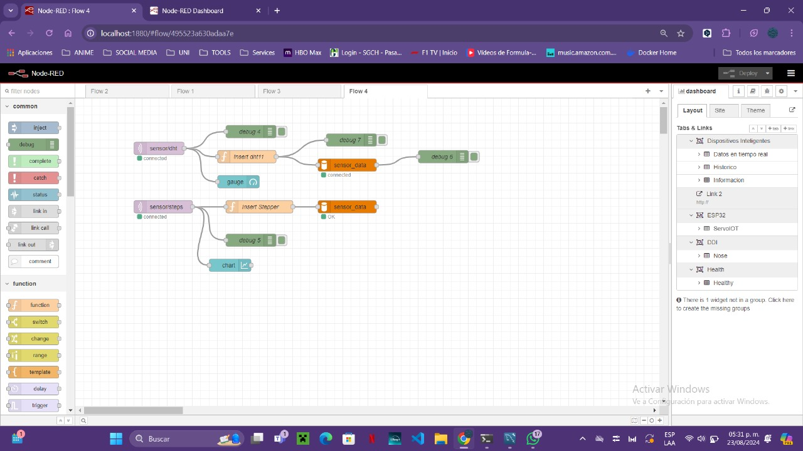
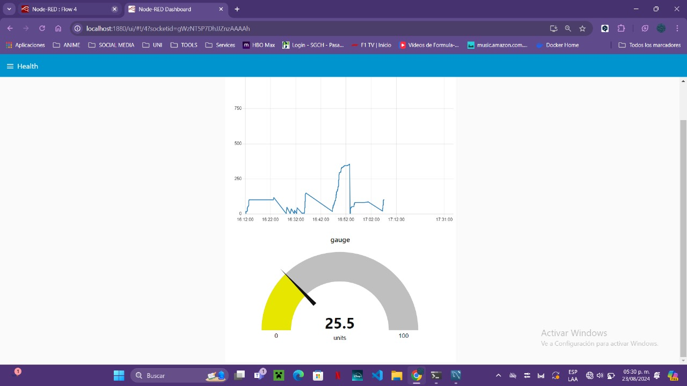

# HealtlyApp
Proyecto desarrollado por:
- Cruz Breña Daniela Janeth
- Elías Velázquez Ángel Uriel
- Garay García Omar Ricardo

## Enunciado de Visión

Desarrollar un circuito y una aplicación de monitoreo de salud que permita a los usuarios registrar los pasos realizados durante el día, como la temperatura, humedad, y calorías quemadas, mediante una conexión establecida con un módulo ESP32. Los datos serán almacenados y gestionados a través del protocolo MQTT utilizando Mosquitto, proporcionando así una solución eficiente y accesible para el seguimiento de la salud desde la comodidad de un smartphone.

## Software Empleado

## Stack Tecnológico

| **Componente**                  | **Descripción**                                       | **Versión** | **Tipo**        |
|---------------------------------|-------------------------------------------------------|-------------|-----------------|
| **Lenguaje de Programación**    | Dart                                                  | 3.94.0      | Lenguaje        |
| **Framework**                   | Flutter                                               | 3.94.0      | Framework       |
| **Backend**                     | Mosquitto MQTT                                        |             | Backend         |
| **Base de Datos**               | MySql        |  8.0           | Base de Datos   |
| **Control de Versiones**        | Git                                                   |  2.43.0.windows.1           | Control de Versión |
| **IDE**                         | Visual Studio Code                                    |  1.92           | IDE             |
| **IDE**                         | Arduino                                  |   1.8.19.          | IDE             |
| **Emulador**                    | Android Studio                                        |    Koala13         | Emulador        |

## Hardware Empleado

| **Id** | **Componente**                       | **Descripción**                                                                                       | **Imagen**                                       | **Cantidad** | **Costo total (MXN)** |
|--------|--------------------------------------|-------------------------------------------------------------------------------------------------------|--------------------------------------------------|--------------|-----------------------|
| 1      | Sensor de Temperatura y Humedad      | Sensor para medir la temperatura y humedad ambiental                                                   |        | 1            | $87.45                |
| 2      | Protoboard                           | Protoboard de 830 puntos para pruebas de conexiones                                                   |    | 1            | $61.75                |
| 3      | Módulo ESP32 WiFi + Bluetooth        | Módulo de microcontrolador ESP32 con conectividad WiFi y Bluetooth                                      |         | 1            | $115.12               |
| 4      | Giroscopio Acelerómetro de 3 Ejes    | Sensor de giroscopio y acelerómetro para detectar la orientación y el movimiento                       |    | 1            | $64.99                |
| 5      | Pantalla OLED 128x32                 | Pantalla OLED para mostrar datos en tiempo real                                                        |      | 1            | $81.00                |
| 6      | Kit Buzzer Zumbador 5V               | Zumbador activo para emitir alertas audibles                                                           |        | 1            | $39.00                |

## Tablero Trello
   [Trello](https://trello.com/b/TBIptBx5/healtlyapp)

## Historias de Usuario

| Historia de Usuario              | Como                  | Quiero                                                | Para                                                   |
|----------------------------------|-----------------------|-------------------------------------------------------|--------------------------------------------------------|
| Registro de Signos Vitales       | Usuario               | Registrar mis pasos dados durante el día           | Monitorear mi salud de manera continua                 |
| Notificaciones de Alertas        | Usuario               | Observar las calorías quemadas | Monitorear mi salud de manera continua               |
| Visualización de Datos           | Usuario               | Ver la temperatura ambiental en una pantalla OLED           | Tener una referencia visual rápida y clara             |
| Acceso Rápido                    | Usuario               | Acceder a los datos de mi salud desde la app          | Monitorear mi salud en cualquier momento     |
| Sincronización de Dispositivos   | Usuario               | Que los datos se sincronicen entre el ESP32 y mi smartphone | Tener acceso a la información actualizada en mi dispositivo móvil |

## Imágenes del Proyecto Finalizado

     
     
     
     
    

